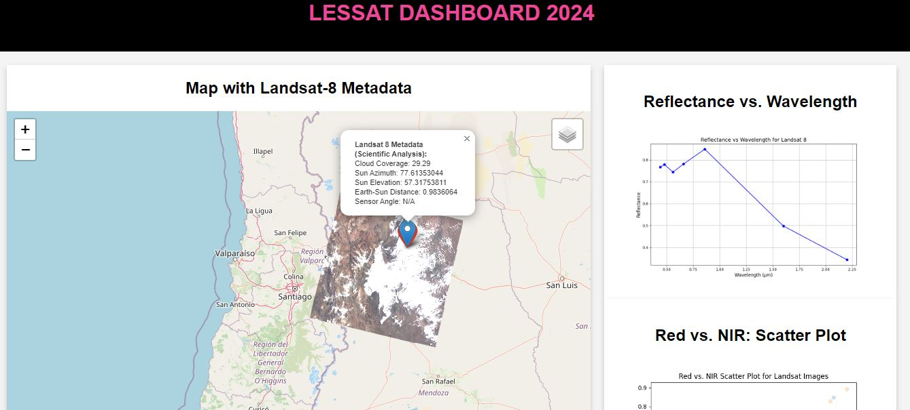
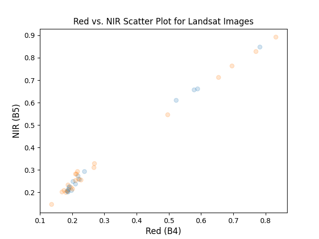
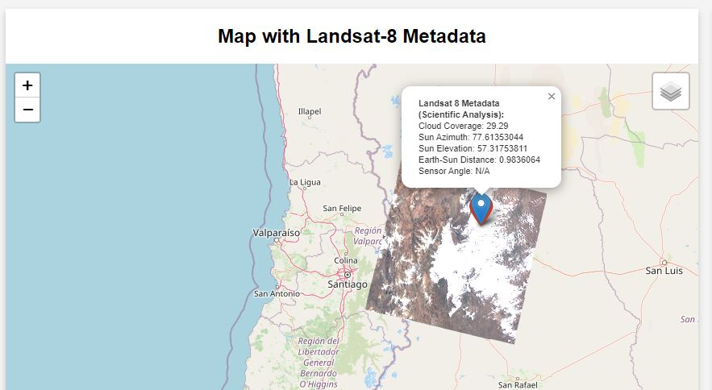
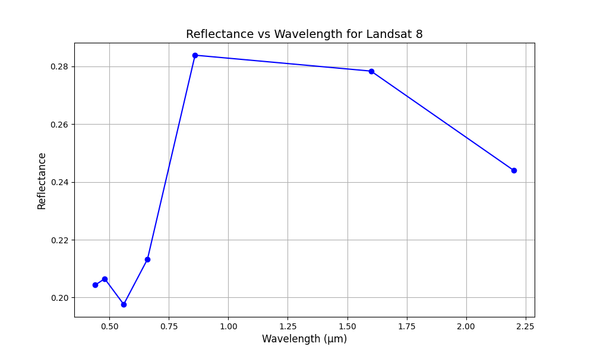

# 🌍 Landsat Data API with FastAPI 🚀

This FastAPI application allows you to interact with Google Earth Engine's Landsat 8 data, providing endpoints for generating **scatter plots** and **interactive maps** for a specified area of interest (Mendoza, Argentina by default).

## 🌟 Features

- **Scatter Plot of Red vs. NIR bands** 📊
- **Map Visualization of Landsat Images** 🗺️
- **Reflectance vs. Wavelength Plot** 📈



---

## 🛠️ Installation & Setup

### Prerequisites

- Python 3.8+ 🐍
- Google Earth Engine account 🌐 (and credentials set up)

### 1. Clone the Repository

```bash
git clone https://github.com/cabustillo13/earth_engine_backend.git
cd earth_engine_backend
```

### 2. Install Dependencies

Create a virtual environment and install the required dependencies from `requirements.txt`:

```bash
python -m venv my_env
source my_env/bin/activate  # On Windows: my_env\Scripts\activate
pip install -r requirements.txt
```

### 3. Authenticate with Google Earth Engine 🌐

Before you can use the API, you need to authenticate your Google Earth Engine account.

Run the following command to authenticate:

```bash
earthengine authenticate
```

Alternatively, you can authenticate in Python:

```python
import ee
ee.Authenticate()
```

### 4. Run the FastAPI Application 🚀

Start the FastAPI server using `uvicorn`:

```bash
uvicorn main:app --reload
```

This will start the application at `http://127.0.0.1:8000`.

---

## 🔥 Endpoints

### 1. **Scatter Plot** 📊

Generates a scatter plot for Red vs. NIR bands from Landsat 8 data within the specified date range.

- **URL**: `POST /generate-scatter-plot/`
- **Request Body**: 
    ```json
    {
        "lat": -32.88,
        "lon": -68.84,
        "start_date": "2024-01-01",
        "end_date": "2025-12-30"
    }
    ```
- **Response**: A generated scatter plot image.
- **Media Type**: `image/png`



### 2. **Map Visualization** 🗺️

Generates an interactive map of Landsat 8 images for the specified Area of Interest.

- **URL**: `POST /generate-map/`
- **Request Body**: 
    ```json
    {
        "lat": -32.88,
        "lon": -68.84,
        "start_date": "2024-01-01",
        "end_date": "2025-12-30"
    }
    ```
- **Response**: An interactive map saved as `map_with_metadata.html`.
- **Media Type**: `text/html`



### 3. **Reflectance vs. Wavelength Plot** 📈

Generates a plot showing reflectance values for each band of Landsat 8 data.

- **URL**: `POST /generate-reflectance-plot/`
- **Request Body**: 
    ```json
    {
        "lat": -32.88,
        "lon": -68.84,
        "start_date": "2024-01-01",
        "end_date": "2025-12-30"
    }
    ```
- **Response**: A generated reflectance vs. wavelength plot image.
- **Media Type**: `image/png`



---

## 📂 Project Structure

```bash
├── main.py             # FastAPI application
├── test.py             # Client script to test API
├── requirements.txt    # Required dependencies
└── README.md           # Documentation 📄
```

---

## 💡 Troubleshooting

- If you receive the error `Please authorize access to your Earth Engine account`, ensure that you’ve authenticated your Earth Engine account.
- Confirm that you’ve installed all necessary libraries from `requirements.txt`.

---

## 🎉 Conclusion

This API facilitates easy access to and visualization of Landsat data for remote sensing and analysis. With just a few endpoints, you can fetch powerful satellite imagery data and visualize it effortlessly!

Feel free to contribute to the project or expand its functionality! Happy coding! 🚀

---

## 📞 Contact

If you encounter any issues, feel free to reach out via a GitHub issue or send me a message.
